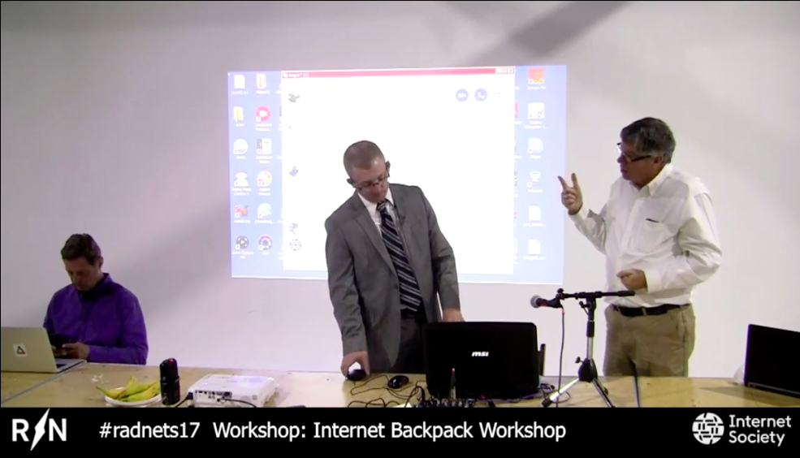

# web-co2
This is the backend that is linked to the Things Network platform by "HTTP-Integration”. 
Data is received from LoRaWAN by PHP input stream. 

You can also find the web interface and the link to the MySQL database in this repository.
This can also be connect to other services like Microsoft Azure for data storage and retreival
after this library has got data from The Things Network platform.

## Internet Backpack Workshop
This is one of the network protocols [(presented by Dr Lee McKnight, Timothy Kelly and George Newman at 
Internet Society conference, the #radnets17)(https://drive.google.com/file/d/152pIF6enLsmup5m-CEBVi22F2wRowIuH/view)] in the workshop on the Internet Backpack.

